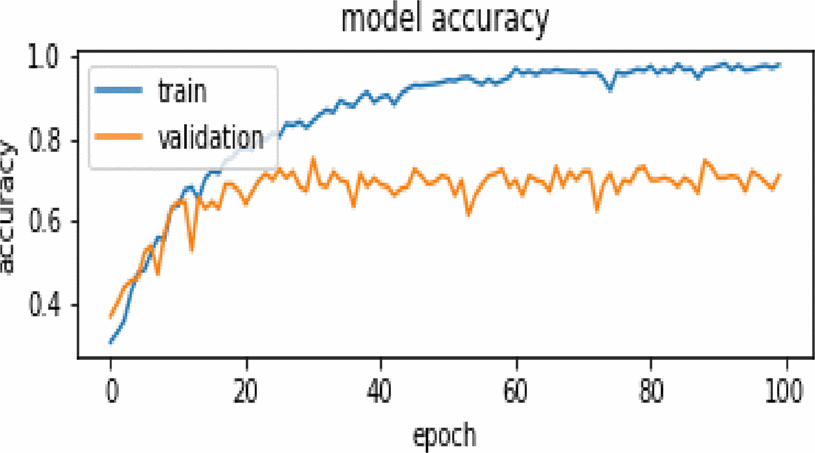

# [Project 1:Deep Learning Based Smart Garbage Classifier](https://ieeexplore.ieee.org/abstract/document/9137938?casa_token=uSJ5FdBcW90AAAAA:o44XGQYbXZKEc2GF65pNV-ynfdqf8UpEz9UKCTxafSjFHT7vy5edLYXroI-lwoyK_xX30NDXbWtGXg)
* Proposed a way to classify the waste and find the category of it with a well defined and labelled data set of images consisting of categories (plastic,paper, cardboard, metals) using Convolutional Neural Network (CNN). 
* Able to achieve a maximum accuracy of 76% and published a paper at IEEE conference

# [Project 2:Pests & weed control autonomous robot using machine vision](https://ieeexplore.ieee.org/abstract/document/9532824?casa_token=M88GKuB0JH8AAAAA:ZOaAvhy-wNPLNSV3yEYPDQhKzXnAmH0teyFlR-hsaPS0QbCUjhYzF4qNnekbaNyNubaRol3Q6vnyew)
* In this B. Tech. thesis work of mine, we planned an autonomous robot which uses deep learning algorithm to find the difference between weedand plant so we could use the pesticides wisely and remove the weedsproperly with less human effort 
* we decided to make this robot connected through cloud(internet) to make the robot lite and simple.

